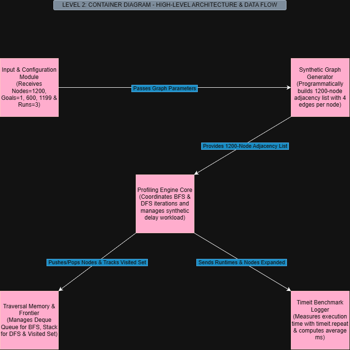
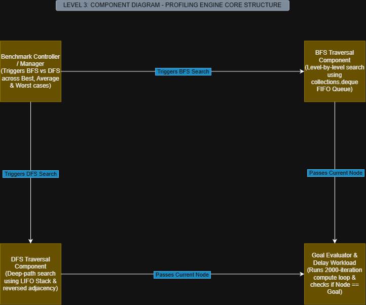

# Architectural Design (Full C4 Model) :

 Empirical Performance Profiling Engine for Uninformed Search Algorithms  

---

## 1. AIM & Objectives :

* **Aim:**  To design, document, and analyze a complete 4-Level C4 Architectural Model (System Context, Container, Component, and Code level) for an Empirical Performance Profiling Engine benchmarking Breadth-First Search (BFS) and Depth-First Search (DFS).

* **Key Objectives:**
  - Map user/system boundary interactions (Level 1 Context).
  - Decompose high-level system modules into distinct functional containers (Level 2 Container).
  - Zoom into core algorithmic orchestration, queues, and delay execution loops (Level 3 Component).
  - Correlate visual C4 components directly to Python implementation modules and methods (Level 4 Code).

---

## 2. System Overview & Problem Formulation :

The system provides an automated empirical profiling architecture to benchmark Breadth-First Search (BFS) and Depth-First Search (DFS) on a structured 1,200-node synthetic graph network. 

### Core Benchmark Setup :

- **Graph Topology:** Directed graph where each node $i$ connects to 4 outgoing nodes: $\{i+1, i+2, i+3, i+4\}$.
- **Node Count:** 1,200 nodes (indexed $0$ to $1199$).
- **Start Node:** Node $0$.
- **Test Goal Configurations:**
  - **Best Case:** Goal Node = $1$
  - **Average Case:** Goal Node = $600$
  - **Worst Case:** Goal Node = $1199$
- **Measurement Method:** Utilizes Python's native `timeit.repeat()` module across $3$ execution runs per test case to capture millisecond-precision runtime and total node expansions while neutralizing OS-level scheduling jitter through a micro-delay loop.

---

## 3. C4 Architecture Model Breakdown :

### Level 1: System Context Diagram :


Defines the highest boundary between external human users and the Profiling Software System.
* **Actor:** Evaluator / User (Student or Benchmark Auditor).
* **Inputs:** Search configuration parameters ($Start = 0$, $Goals = [1, 600, 1199]$, $Runs = 3$).
* **System Operations:** Constructs synthetic topology, triggers search algorithms, and monitors execution metrics.
* **Outputs:** Empirical performance outputs including average execution time (in ms), total node expansion counts, and search status.

---

### Level 2: Container Diagram :



Decomposes the high-level system into 5 distinct, decoupled containers:
1. **Input & Configuration Module:** Captures search input variables ($Start$, $Goals$, $Runs$) and validates parameters.
2. **Synthetic Graph Generator:** Programmatically builds the 1,200-node adjacency dictionary according to out-degree rules.
3. **Profiling Engine Core:** Manages traversal execution flow, algorithm switching (BFS vs DFS), and microsecond delay loops.
4. **Traversal Memory & Frontier:** Stores active search frontiers using `collections.deque` (BFS FIFO queue), Python lists (DFS LIFO stack), and a hash-set (`visited`) to prevent duplicate node visits.
5. **Timeit Benchmark Logger:** Executes `timeit.repeat(repeat=3)`, converts raw execution timings to milliseconds, and formats tabular benchmark reports.

---

### Level 3: Component Diagram :



Zooms directly into the **Profiling Engine Core** container to detail internal search logic and compute mechanics:
* **Benchmark Controller / Manager:** Orchestrates test suite execution across Best, Average, and Worst cases for both BFS and DFS.
* **BFS Traversal Component:** Implements level-order exploration using `deque.popleft()` to guarantee shallowest path resolution.
* **DFS Traversal Component:** Implements deep-path exploration using `list.pop()` paired with `reversed(graph[node])` neighbor insertion to maintain deterministic right-to-left depth search.
* **Goal Evaluator & Delay Workload:** Evaluates `Current Node == Goal` at every expansion step. Incorporates a 2,000-iteration CPU compute delay loop per expanded node to stabilize microsecond timer resolution against CPU frequency scaling and background OS task switches.

---

### Level 4: Code / Class Level Overview :


Maps component architecture directly to concrete Python functions in the implementation:
* `create_graph(total_nodes=1200, edges_per_node=4)`: Programmatically returns adjacency dictionary `{i: [i+1, i+2, i+3, i+4]}`.
* `bfs(graph, start, goal)`: Executes queue-based level search, increments node expansion counters, and triggers the synthetic workload.
* `dfs(graph, start, goal)`: Executes stack-based depth search with reversed adjacency pushing and workload delays.
* `profile_algorithm(algorithm_func, graph, start, goal)`: Wraps execution inside `timeit.repeat(stmt=..., repeat=3)`, calculates mean execution times, converts values to milliseconds ($ms$), and prints structured output logs.

---

## 4. Architectural Design Decisions & Rationale :

1. **Decoupled Graph Construction:**  
   Separating the `Synthetic Graph Generator` container from the `Profiling Engine Core` ensures that dictionary creation and memory allocation overheads are completely excluded from algorithmic runtime measurements.
2. **Synthetic Delay Loop Insertion:**  
   Because uninformed search operations on small memory graphs execute in sub-millisecond durations, OS-level thread preemptions introduce extreme measurement variance. Injecting a 2,000-iteration compute loop per node expansion amplifies the execution signature, ensuring statistically reliable timer measurements.
3. **Adjacency Reversal in DFS Stack Management:**  
   In DFS implementations using standard LIFO stacks, pushing neighbors in original order results in left-to-right exploration inverted depth paths. Applying `reversed(graph[node])` before pushing ensures right-to-left depth traversal that strictly aligns with theoretical search tree models.

---

## 5. Repository File Structure :

```text
├── C4_Levels_Level1_Context.png     # High-Level Context Diagram
├── C4_Levels_Level2_Container.png   # System Container Architecture Diagram
├── C4_Levels_Level3_Component.png   # Engine Core Component Diagram
├── C4_Levels_Level4_Code.png        # Code Function Mapping Diagram
├── SLE2_BFS_vs_DFS.py               # Underlying Python Benchmark Source Code
├── README.md                        # Architectural Documentation & C4 Model Guide
├── AI_Contribution_Log.md           # Transparency Log of AI Tools vs Student Contributions
└── SLE-3_Architectural_Design_Report.pdf  # Final Consolidated PDF Report Submission